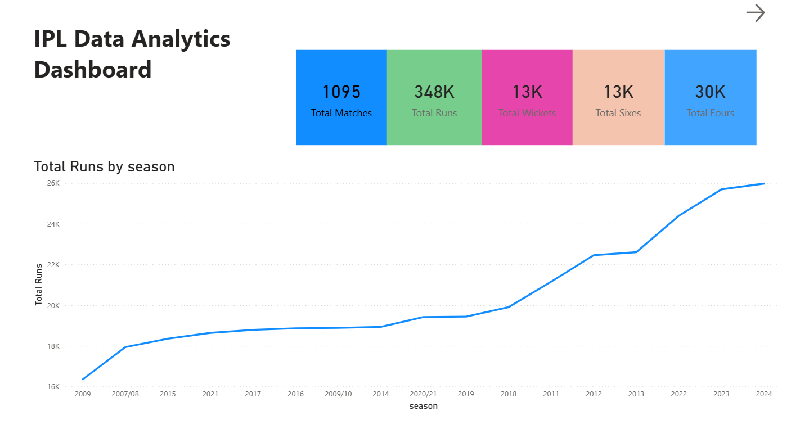
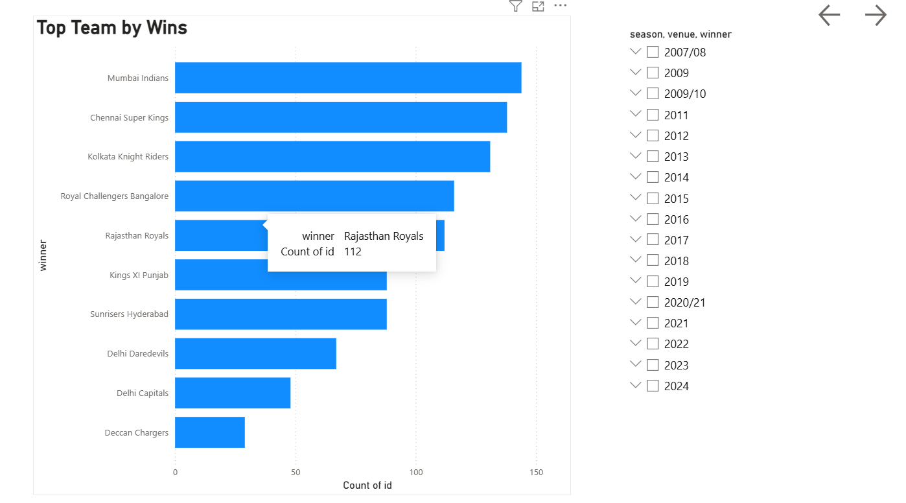
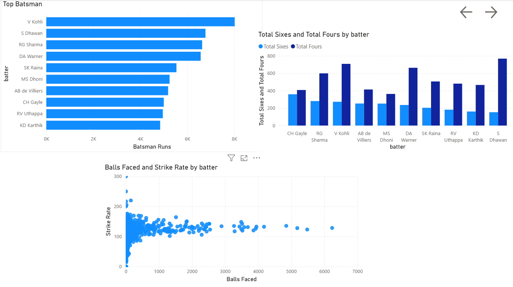
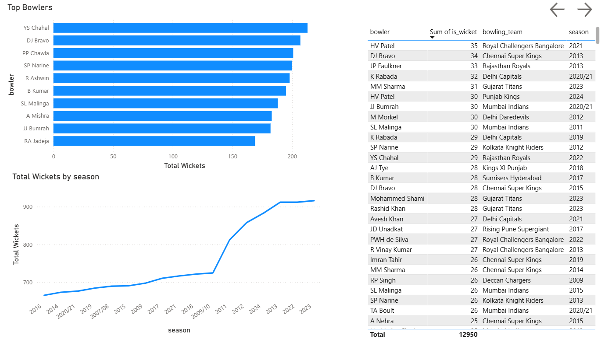
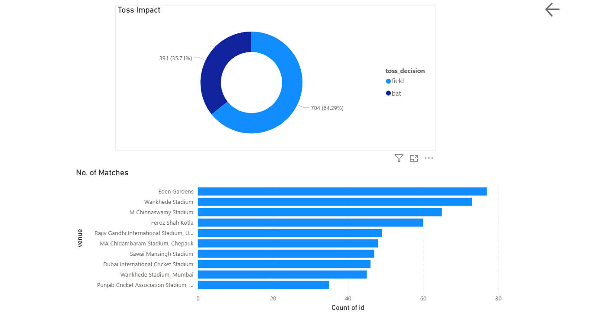

# IPL Data Analytics Dashboard

## Project Overview

This project presents an interactive IPL (Indian Premier League) Analytics Dashboard built using Power BI. The dashboard provides insights into team performance, player statistics, batting trends, bowling effectiveness, venue analysis, and the impact of toss decisions across IPL seasons.
The objective of this project is to transform raw IPL match data into meaningful visualizations and actionable insights using data analytics techniques.

---

## Tools & Technologies

* Power BI
* DAX (Data Analysis Expressions)
* Power Query
* CSV Files
* Data Modeling

---

## Dataset

The project uses IPL historical match data containing:

### Matches Dataset

* Match ID
* Season
* Venue
* Team1
* Team2
* Toss Winner
* Toss Decision
* Match Winner
* Player of the Match

### Deliveries Dataset

* Match ID
* Batter
* Bowler
* Total Runs
* Batsman Runs
* Extras
* Wicket Information

---

## Data Preparation

The following steps were performed before creating the dashboard:

1. Imported IPL datasets into Power BI.
2. Cleaned and transformed data using Power Query.
3. Corrected data types and handled missing values.
4. Created relationships between Matches and Deliveries tables.
5. Built calculated measures using DAX.
6. Designed interactive visualizations and slicers.

---

## DAX Measures Used

### Total Runs

```DAX
Total Runs = SUM(deliveries[total_runs])
```

### Total Matches

```DAX
Total Matches = DISTINCTCOUNT(matches[id])
```

### Total Sixes

```DAX
Total Sixes =
CALCULATE(
COUNTROWS(deliveries),
deliveries[batsman_runs] = 6
)
```

### Total Fours

```DAX
Total Sixes =
CALCULATE(
COUNTROWS(deliveries),
deliveries[batsman_runs] = 4
)
```

### Total Wickets

```DAX
Total Wickets =
COUNT(deliveries[player_dismissed])
```

---

## Key Findings

* IPL scoring has generally increased across seasons, indicating more aggressive batting strategies.
* A few franchises consistently dominate the league in terms of total wins.
* Boundary scoring contributes significantly to total runs.
* Winning the toss provides a tactical advantage but does not guarantee victory.
* Venue conditions influence scoring patterns and match outcomes.


---

## Dashboard Preview











---


## Project Outcomes

This project demonstrates:

* Data Cleaning and Transformation
* Data Modeling
* DAX Calculations
* Interactive Dashboard Development
* Data Visualization
* Business Insight Generation

---

## Author

Dinesh